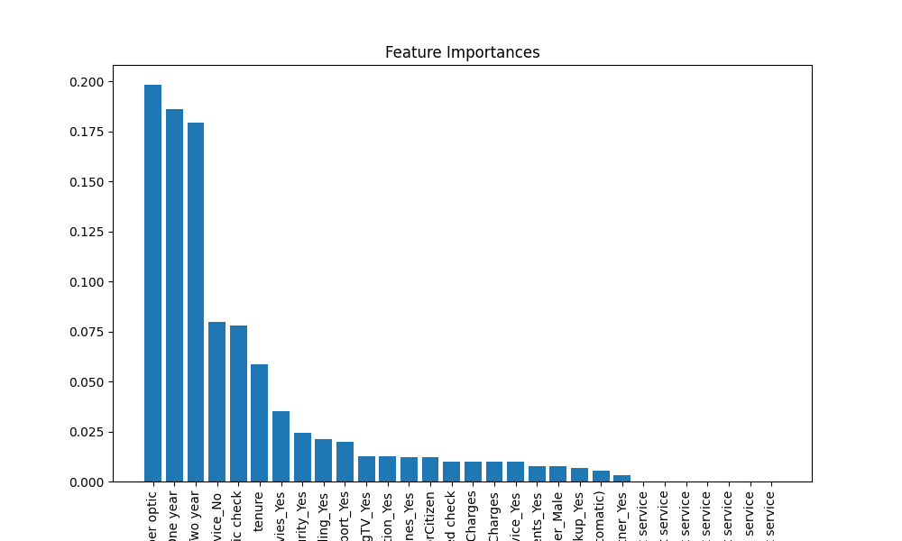

# Customer Churn Prediction

This project aims to predict customer churn using various machine learning models, including Logistic Regression, Random Forest and Gradient Boosting (XGBoost). The models are trained and evaluated on the Telco Customer Churn dataset.

## Dataset

The dataset can be downloaded from [`Kaggle`](https://www.kaggle.com/blastchar/telco-customer-churn). It contains 7,043 customer records with the following features:

- 'customerID': Customer ID
- 'gender': Gender of the customer
- 'SeniorCitizen': Whether the customer is a senior citizen
- 'Partner': Whether the customer has a partner
- 'Dependents': Whether the customer has dependents
- 'tenure': Number of months the customer has stayed with the company
- 'PhoneService': Whether the customer has phone service
- 'MultipleLines': Whether the customer has multiple lines
- 'InternetService': Customer's internet service provider
- 'OnlineSecurity': Whether the customer has online security
- 'OnlineBackup': Whether the customer has online backup
- 'DeviceProtection': Whether the customer has device protection
- 'TechSupport': Whether the customer has tech support
- 'StreamingTV': Whether the customer has streaming TV
- 'StreamingMovies': Whether the customer has streaming movies
- 'Contract': The contract term of the customer
- 'PaperlessBilling': Whether the customer uses paperless billing
- 'PaymentMethod': The customer's payment method
- 'MonthlyCharges': The amount charged to the customer monthly
- 'TotalCharges': The total amount charged to the customer
- 'Churn': Whether the customer churned (target variable)

## Prerequisites

To run the code, you need to have the following libraries installed:

- pandas
- numpy
- scikit-learn
- xgboost
- matplotlib
- seaborn

## Project Structure

The project is structured as follows:

- `telco-customer-churn.csv`: The dataset file containing customer data.
- `churn_prediction.py`: The main script to preprocess the data, train models, and evaluate their performance.
- `README.md`: This file, providing an overview and instructions for the project.

## Data Preprocessing

1. **Load the Dataset**: The dataset is loaded from a CSV file.
2. **Convert 'TotalCharges' to Numeric**: Coerce errors to NaN and fill NaN values with the mean.
3. **Encode Categorical Variables**: One-Hot Encoding is used to convert categorical variables.
4. **Normalize Numerical Features**: StandardScaler is used to normalize numerical features.

## Models

Three machine learning models are trained and evaluated:

1. **Logistic Regression**
2. **Random Forest**
3. **Gradient Boosting (XGBoost)**

Hyperparameter tuning is performed using GridSearchCV for the Gradient Boosting model.

## Evaluation

The models are evaluated using the following metrics:

- Accuracy
- Confusion Matrix
- Classification Report (Precision, Recall, F1-Score)
- ROC Curve
- Feature Importance (for the best model)

The script prints the evaluation results for each model and plots the feature importance determined by the Gradient Boosting model.

## Usage

1. **Download the Dataset**: Ensure you have downloaded the dataset from Kaggle and placed it in the appropriate directory (`c:\Users\md mursaleen\Downloads\telco-customer-churn.csv`).

2. **Install Required Libraries**: Install the necessary Python libraries using pip:

   ```sh
   pip install pandas numpy scikit-learn xgboost matplotlib seaborn
   ```

3. **To run the project, follow these steps**:

   Clone the repository:

   ```sh
       git clone https://github.com/Md-Mursaleen/AspireNex-Churn-Prediction.git
   ```

   Install dependencies:

   ```sh
       pip install pandas scikit-learn
   ```

   Run the script:

   ```sh
       python fraud_detection.py
   ```

## Output




